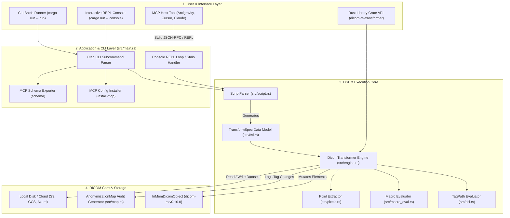
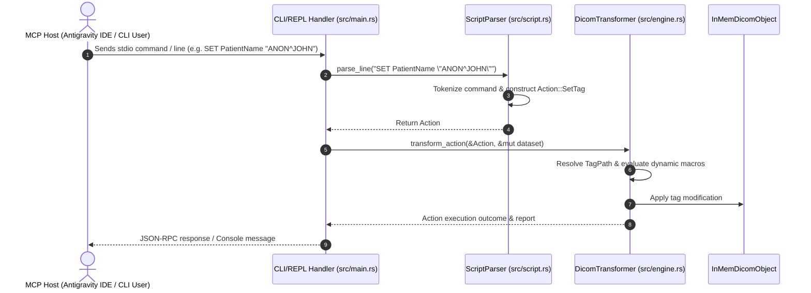
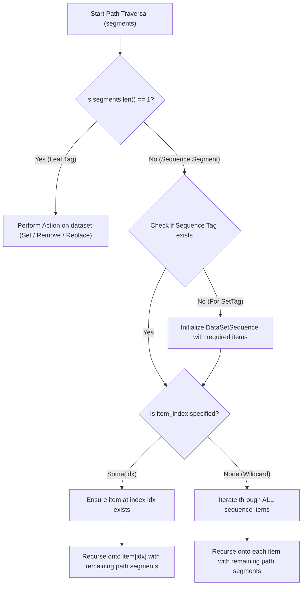

# System Design Document (SDD): DICOM Transformer & MCP Architecture

This document details the system architecture, component design, execution flows, and medical device software traceability matrix for `dicom-rs-transformer`.

`dicom-rs-transformer` is a Rust-based command-line interface (CLI) application and software library engineered for high-performance DICOM (Digital Imaging and Communications in Medicine) data transformation, anonymization, and inspection. Its core architecture centers on a **Domain-Specific Language (DSL) execution engine** integrated with an interactive **Model Context Protocol (MCP)** server interface for AI-agent workflow automation.

---

## Medical Device Software Traceability Seed (ISO 13485 / IEC 62304 / ISO 14971)

> **Regulatory Note:** This software is published as an open-source tool/library for research, educational, and pipeline automation purposes. To avoid unintended regulatory liabilities while supporting enterprise adopters, this System Design Document (SDD) serves as the **Traceability Seed Matrix** mapping software architecture components directly to international medical device software lifecycle standards. This document is structured to aid developers in building and integrating this codebase into fully validated and regulatory-compliant healthcare products:

| Standard & Section | Medical Lifecycle Domain | Repository Mapping & Coverage in this SDD |
| :--- | :--- | :--- |
| **IEC 62304 §5.2** | **Software Requirements Analysis** | Documented in Section 1 (*Intended Purpose, System Capabilities, De-identification*) |
| **IEC 62304 §5.3** | **Software Architectural Design** | Documented in Section 2 & 3 (*Overall Architecture, Subsystems, CLI & MCP*) |
| **IEC 62304 §5.4** | **Software Detailed Design** | Documented in Section 4 & 5 (*DSL Engine, Sequence Traversal, Macro Evaluation*) |
| **IEC 62304 §5.5/5.6** | **Software Unit & Integration Testing** | Documented in Section 6 (*Testing Strategy, Property Tests, Validation Matrix*) |
| **ISO 14971 §4/§5** | **Risk Analysis & Mitigation** | Documented in Section 7 (*Security, PHI Leakage Risks, Unintended Mutation Risks*) |
| **ISO 13485 §7.3.7** | **Design Verification & Validation** | Automated CI pipeline (`cargo test`, regression benchmarks, de-identification maps) |

---

## 1. System Overview & Intended Purpose

### 1.1 Purpose
`dicom-rs-transformer` provides a robust, scriptable DICOM attribute transformation engine designed to perform repeatable dataset manipulations prior to ingestion into clinical trial databases, AI model training pipelines, or medical imaging research archives.

### 1.2 Key System Capabilities
1. **CLI Execution & Subcommands**: Batch process DICOM datasets via `run`, validate script syntax via `validate`, and compile line scripts into canonical JSON DSL files via `compile`.
2. **MCP Terminal & Console Integration**: Interactive REPL mode (`console`) compatible with Model Context Protocol (MCP) tool pipelines, enabling local AI developer environments (Antigravity IDE, Cursor, Claude Desktop) to programmatically query and alter DICOM data via stdio.
3. **DSL Execution Core**: Declarative JSON specification engine and line-by-line text script language for querying, mutating, stripping, or anonymizing top-level tags and nested DICOM Sequence elements (VR = `SQ`).
4. **Dynamic Value Generation**: Macro expansion framework (`$uid`, `$today`, `$rand_str`, `$rand_num`, `$rand_time`) for dynamic tag synthesis during transformation.
5. **Auditable Audit Maps**: Automatic generation of structured JSON audit logs (`map.json`) mapping pre-transformed tag values to modified outputs for compliance auditing (HIPAA / GDPR).

---

## 2. Overall System Architecture

The system is structured into four primary layers: **User/Interface Layer**, **Application & CLI Layer**, **DSL & Parsing Engine**, and **DICOM Core & Audit Layer**.



---

## 3. Subsystem Architecture

### 3.1 CLI & MCP Interface Subsystem (`src/main.rs`)

The entry binary provides command-line dispatching and native MCP registration capabilities:

- **Subcommands**:
  - `run`: Reads DICOM from `--input`, executes `--script` or `--dsl`, saves transformed result to `--output`.
  - `console`: Launches an interactive REPL session accepting line-by-line script commands over standard input/output.
  - `validate`: Parses script/DSL files without executing dataset mutations to verify syntax correctness.
  - `compile`: Transpiles line scripts (`.txt`) into structured JSON specs (`.json`) or vice-versa.
  - `schema`: Generates the MCP JSON tool schema detailing available tools (`load_dataset`, `set_tag`, `remove_tag`, `replace_value`, `anonymize_patient`, etc.).
  - `install-mcp`: Automatically registers the binary path into host AI developer tool configurations (`~/.gemini/antigravity-ide/mcp/dicom-transformer.json`, Cursor, Claude Desktop).



---

### 3.2 DSL Specification & Data Models (`src/dsl.rs` & `src/script.rs`)

The system uses a unified specification model shared between line-by-line scripts and canonical JSON specifications.

#### Specification Types
- **`TransformSpec`**: Top-level model containing metadata (`version`, `name`, `description`) and an ordered list of `Action` items.
- **`Action`**: Enum representing operations:
  - `LoadDataset { location }`
  - `SaveDataset { location }`
  - `SaveMap { location }`
  - `ExtractPixels { destination, format }`
  - `SetTag { selector, value }`
  - `RemoveTag { selector }`
  - `ReplaceValue { selector, pattern, replacement }`
  - `AnonymizePatient { patient_name, patient_id }`
- **`TagSelector`**: Flexible tag addressing format supporting:
  - Keyword: `"PatientName"`
  - Hex Pair String: `"(0010,0010)"`
  - Group/Element Tuple: `{ "group": 16, "element": 16 }`
  - Sequence Path String: `"RequestAttributesSequence[0]/ScheduledProcedureStepID"`

---

### 3.3 Transformation Engine & Path Evaluator (`src/engine.rs`)

The core execution engine targets `dicom_object::InMemDicomObject` provided by `dicom-rs`.

#### Path Traversal Syntax
Nested DICOM Sequence elements (VR = `SQ`) are addressed via Unix-style slash (`/`) path notation:

$$\text{Path} = \text{Tag}_1[\text{index}_1] / \text{Tag}_2[\text{index}_2] / \dots / \text{TargetTag}$$

| Path Pattern | Target Selection | Traversal Behavior |
| :--- | :--- | :--- |
| `PatientName` | Top-level element `(0010,0010)` | Single element lookup |
| `RequestAttributesSequence[0]/ScheduledProcedureStepID` | Item `0` of sequence `(0040,0275)` | Direct sequence item indexing |
| `RequestAttributesSequence/ScheduledProcedureStepID` | All items of sequence `(0040,0275)` | **Wildcard scanning**: Operates across every item in sequence |
| `ContentSequence[0]/ConceptNameCodeSequence[0]/CodeValue` | Deeply nested sequence item | Recursive hierarchy traversal |



---

### 3.4 Dynamic Macro Evaluator (`src/macro_eval.rs`)

String values passed to `SET` or `REPLACE` commands are dynamically evaluated at runtime before mutating datasets:

- **`$uid`**: Generates a valid ISO OID DICOM UID derived from UUID v4.
- **`$rand_str(n)`**: Generates a random uppercase alphanumeric string of length `n`.
- **`$rand_num(low, high)`**: Generates a random integer within `[low, high]`.
- **`$rand_time()`**: Generates a random DICOM formatted time string (`HHMMSS`).
- **`$today(offset)`**: Generates today's date formatted as `YYYYMMDD` with optional day offsets (e.g., `$today(-7)`).

---

### 3.5 Anonymization Audit Map (`src/map.rs`)

Maintains an audit ledger of all dataset modifications for regulatory tracking:
- Records `tag`, `keyword`, `original_value`, and `new_value`.
- Exportable to structured JSON files (`SAVE_MAP "audit_map.json"`) to enable de-anonymization lookup or HIPAA audit verification.

---

## 4. Verification & Testing Strategy

`dicom-rs-transformer` implements a 3-tier testing framework to guarantee software stability and data integrity:

### 4.1 Unit Testing (`src/`)
- **DSL & Path Parser (`src/dsl.rs`)**: Validates tag path parsing across single keywords, hex strings, indexed paths (`[0]`), wildcard paths (`/`), and malformed path handling.
- **Transformation Engine (`src/engine.rs`)**:
  - `test_set_and_remove_tag`: Verifies top-level element mutations and deletions.
  - `test_sequence_path_indexed_set_and_remove`: Tests item-indexed sequence mutations (`RequestAttributesSequence[0]/...`).
  - `test_sequence_path_wildcard_set_remove_and_replace`: Tests multi-item wildcard sequence modifications.
  - `test_macro_evaluation_in_engine`: Verifies macro expansion integration during dataset writes.

### 4.2 Integration Testing (`tests/transformation_tests.rs`)
- `test_full_transformation_pipeline`: End-to-end programmatic JSON spec execution test.
- `test_script_parser_and_execution`: End-to-end line script parsing and dataset execution test.
- `test_sequence_transformation_script_and_json`: Multi-action nested sequence element transformation test.

### 4.3 Automated Verification Commands
```bash
# Run unit and integration test suite
cargo test

# Validate script syntax without dataset execution
cargo run -- validate --script sample_script.txt

# Transpile script to JSON specification
cargo run -- compile --script sample_script.txt -o spec.json
```

---

## 5. Risk Analysis & Safety Controls (ISO 14971 Seed)

This section maps software failure modes to implemented system mitigations to seed formal ISO 14971 Risk Management Files:

| Failure Mode / Hazard | Severity | Implemented Technical Mitigation | Verification Method |
| :--- | :--- | :--- | :--- |
| **Accidental PHI Leakage** in output dataset | High | Automated de-identification mapping (`map.json`), tag whitelist/anonymization macros (`ANONYMIZE`) | Unit tests (`src/engine.rs`), integration pipeline tests |
| **Sequence Traversal Out-of-Bounds** | Medium | Safe sequence item initialization bounds checking (`DicomTransformer::ensure_sequence_path`) | Unit tests (`test_sequence_path_indexed_set_and_remove`) |
| **Malformed Tag Path Expression** | Low | Explicit `TagPathParseError` enum with failure reporting before mutation phase | Unit tests (`src/dsl.rs`) |
| **Unintended File Overwrite** | Medium | Atomic file write buffer streams and explicit input/output path validation | Integration tests (`tests/transformation_tests.rs`) |
| **Unauthorized MCP Stdio Execution** | Medium | Restricted local OS user sub-process session execution and file access permissions | Security guidelines (`docs/developing/security-guidelines.md`) |

---

## 6. QA Verification Checklist for Testing New Features

1. **Compilation & Unit Pass**: Execute `cargo test` and ensure 0 failures.
2. **Sequence Index Edge Cases**: Test indexing past existing sequence length (engine should append empty items without out-of-bounds panics).
3. **Empty Sequence Handling**: Verify wildcard scanning on empty sequences safely results in 0 modifications without breaking pipeline execution.
4. **Audit Map Verification**: Ensure generated `map.json` contains full path strings matching transformed tags.
