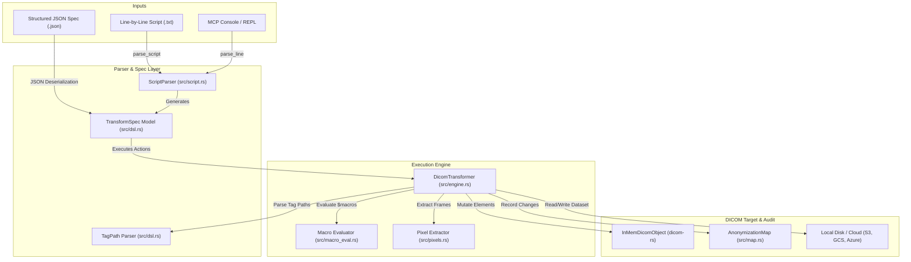
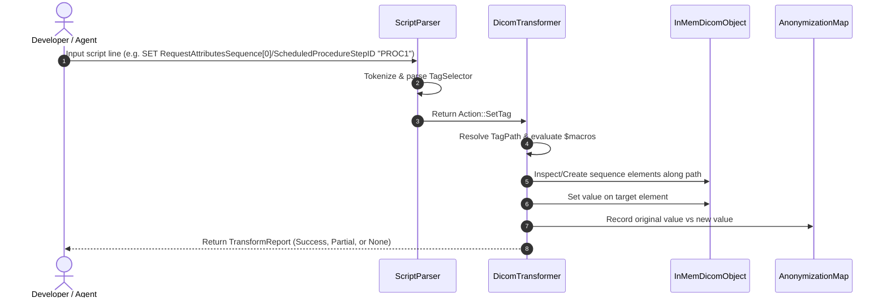
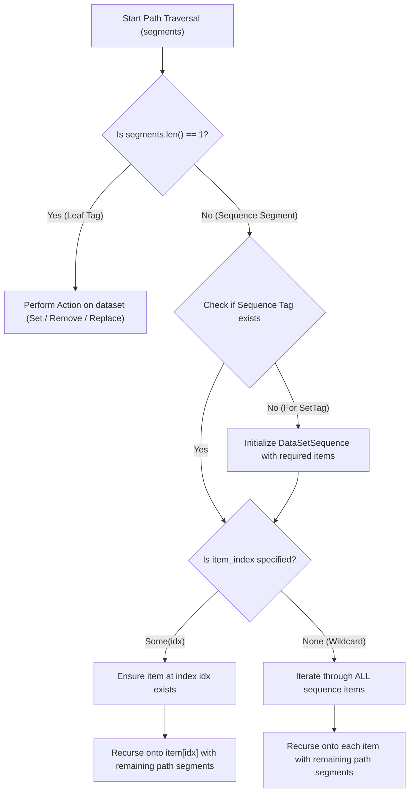

# DICOM Transformer DSL Architecture & Design

This document details the architecture, design principles, component structure, and testing strategy for the `dicom-rs-transformer` Domain Specific Language (DSL) engine.

It is intended for **software developers**, **QA automation engineers**, and **project managers** maintaining or integrating with the transformation engine.

---

## 1. Intended Purpose & Business Goals

### What is `dicom-rs-transformer` DSL?

The **DICOM Transformation DSL** is a declarative specification language and execution engine designed to perform programmatic, repeatable transformations on DICOM (Digital Imaging and Communications in Medicine) datasets.

### Primary Goals & Use Cases

1. **Patient Anonymization & De-identification**: Strip or replace Protected Health Information (PHI) such as patient names, IDs, addresses, and hospital metadata prior to sharing datasets with AI researchers or clinical trials.
2. **DICOM Sequence Element Handling**: Query, insert, mutate, and delete nested attributes inside DICOM Sequence elements (VR = `SQ`) using path expressions (e.g., `RequestAttributesSequence[0]/ScheduledProcedureStepID`).
3. **Batch & Pipeline Automation**: Execute rule sets stored in structured JSON format or simple line-by-line script files (`.txt`).
4. **AI & MCP Tool Integration**: Expose an interactive Model Context Protocol (MCP) console allowing AI agents and CLI users to safely modify DICOM files programmatically.
5. **Anonymization Auditability**: Generate verifiable JSON mapping files (`map.json`) linking original values to anonymized replacements for compliance auditing.

---

## 2. Overall Architectural Structure

The system follows a modular pipeline architecture separating parsing, specification modeling, dynamic macro evaluation, dataset mutation, and audit logging.



---

### Core Components Deep-Dive

#### A. DSL Specification & Data Models (`src/dsl.rs`)
- **`TransformSpec`**: Top-level specification containing metadata (`version`, `name`, `description`) and an ordered list of `Action` items.
- **`Action`**: Enum representing executable actions:
  - `LoadDataset { location }`
  - `SaveDataset { location }`
  - `SaveMap { location }`
  - `ExtractPixels { destination, format }`
  - `SetTag { selector, value }`
  - `RemoveTag { selector }`
  - `ReplaceValue { selector, pattern, replacement }`
  - `AnonymizePatient { patient_name, patient_id }`
- **`TagSelector`**: Enum supporting Keyword (`"PatientName"`), Hex Pair String (`"(0010,0010)"`), Group/Element Tuple (`{ "group": 16, "element": 16 }`), or Sequence Path String (`"RequestAttributesSequence[0]/ScheduledProcedureStepID"`).
- **`TagPath` & `TagPathSegment`**: Structured representation of tag hierarchies:
  - `TagPathSegment`: Holds target `dicom_core::Tag` and an optional sequence item index (`Option<usize>`).
  - `TagPath`: Ordered vector of `TagPathSegment`s representing multi-level sequence paths.

#### B. Line-by-Line Script Parser (`src/script.rs`)
- **`ScriptParser`**: Parses human-readable text commands into `TransformSpec` models.
- **Tokenizer**: Handles whitespace separation and quoted string literals with escape sequence support.

#### C. Transformation Engine (`src/engine.rs`)
- **`DicomTransformer`**: Evaluates pipeline actions sequentially against an `InMemDicomObject`.
- **Path Navigation Helpers**:
  - `apply_set_path`: Navigates down sequence paths. If intermediate sequence items or elements do not exist, they are initialized automatically.
  - `apply_remove_path`: Removes matching target elements from specific item indices or across all items.
  - `apply_replace_path`: Replaces matching substring patterns inside target elements.
  - `get_tag_path_str`: Reads pre-existing string values along paths for audit logging.



#### D. Dynamic Macro Evaluator (`src/macro_eval.rs`)
Evaluates dynamic placeholders in string values before mutating datasets:
- **`$uid`**: Generates a valid ISO OID DICOM UID derived from UUID v4.
- **`$rand_str(n)`**: Generates a random uppercase string of length `n`.
- **`$rand_num(low, high)`**: Generates a random integer within `[low, high]`.
- **`$rand_time()`**: Generates a random DICOM formatted time string (`HHMMSS`).
- **`$today(offset)`**: Generates today's date formatted as `YYYYMMDD` with optional +/- day offsets.

#### E. Anonymization Audit Map (`src/map.rs`)
- **`AnonymizationMap`**: Maintains structured audit entries (`tag`, `keyword`, `original_value`, `new_value`) exportable to JSON via `SAVE_MAP` for HIPAA / GDPR compliance verification.

---

## 3. DICOM Sequence Element Path Architecture

### Syntax Specification

Sequence elements are targeted using Unix-style slash (`/`) path notation:

$$\text{Path} = \text{Tag}_1[\text{index}_1] / \text{Tag}_2[\text{index}_2] / \dots / \text{TargetTag}$$

| Syntax Example | Target Element | Item Selection Behavior |
| :--- | :--- | :--- |
| `PatientName` | Top-level element `(0010,0010)` | Single element. |
| `RequestAttributesSequence[0]/ScheduledProcedureStepID` | Item `0` of sequence `(0040,0275)` | Specific sequence item index `0`. |
| `RequestAttributesSequence[1]/ScheduledProcedureStepID` | Item `1` of sequence `(0040,0275)` | Specific sequence item index `1`. |
| `RequestAttributesSequence/ScheduledProcedureStepID` | All items of sequence `(0040,0275)` | **Wildcard scanning**: Operates on **every** sequence item present. |
| `RequestAttributesSequence[*]/ScheduledProcedureStepID` | All items of sequence `(0040,0275)` | Explicit wildcard star syntax. |
| `ContentSequence[0]/ConceptNameCodeSequence[0]/CodeValue` | Nested sequence item | Multi-level sequence hierarchy traversal. |

### Traversal Algorithm



---

## 4. Testing Strategy & QA Guidance

`dicom-rs-transformer` utilizes a 3-tier testing methodology to guarantee data integrity and regression safety.

### A. Unit Tests (`src/`)
- **DSL & Path Parsing (`src/dsl.rs`)**:
  - Validates `TagPath::parse` across single keywords, hex pairs, indexed sequence paths (`[0]`), wildcard paths (`/` and `[*]`), and error cases (empty paths, invalid indices).
- **Engine Operations (`src/engine.rs`)**:
  - `test_set_and_remove_tag`: Verifies top-level tag mutations and deletions.
  - `test_sequence_path_indexed_set_and_remove`: Verifies item-indexed mutations (`RequestAttributesSequence[0]/...`).
  - `test_sequence_path_wildcard_set_remove_and_replace`: Verifies multi-item wildcard sequence iteration and substring replacements.
  - `test_macro_evaluation_in_engine`: Verifies macro expansion integrated within transformation actions.

### B. Integration Tests (`tests/transformation_tests.rs`)
- **`test_full_transformation_pipeline`**: Programmatic `TransformSpec` execution test.
- **`test_script_parser_and_execution`**: Line-by-line script parsing and dataset execution test.
- **`test_sequence_transformation_script_and_json`**: Multi-action sequence element script execution test.

### C. CLI & Tooling Verification
- **Script Validation Command**:
  ```bash
  cargo run -- validate --script sample_script.txt
  ```
- **Offline Rule Compilation Command**:
  ```bash
  # Compile line script into reusable canonical JSON specification
  cargo run -- compile --script sample_script.txt -o spec.json

  # Decompile JSON spec into formatted text script
  cargo run -- compile --dsl spec.json -o script.txt
  ```
- **JSON DSL Validation Command**:
  ```bash
  cargo run -- validate --dsl spec.json
  ```
- **Schema Auto-Discovery**:
  ```bash
  cargo run -- schema
  ```

### QA Verification Checklist for Testing New Features
1. **Compilation & Unit Pass**: Execute `cargo test` and ensure 0 failures.
2. **Sequence Index Edge Cases**: Test indexing past existing sequence length (engine should append empty items without out-of-bounds panics).
3. **Empty Sequence Handling**: Verify wildcard scanning on empty sequences safely results in 0 modifications without breaking pipeline execution.
4. **Audit Map Verification**: Ensure generated `map.json` contains full path strings (e.g. `RequestAttributesSequence[0]/ScheduledProcedureStepID`) matching transformed tags.
