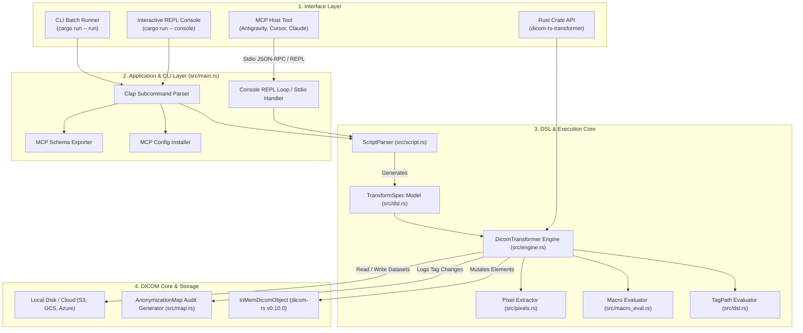
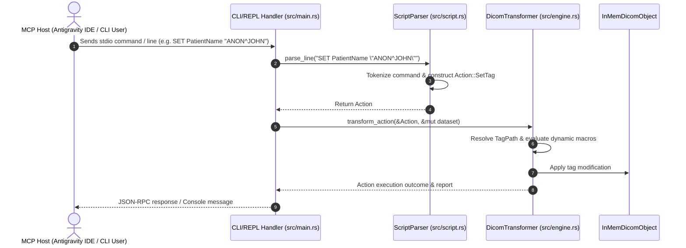
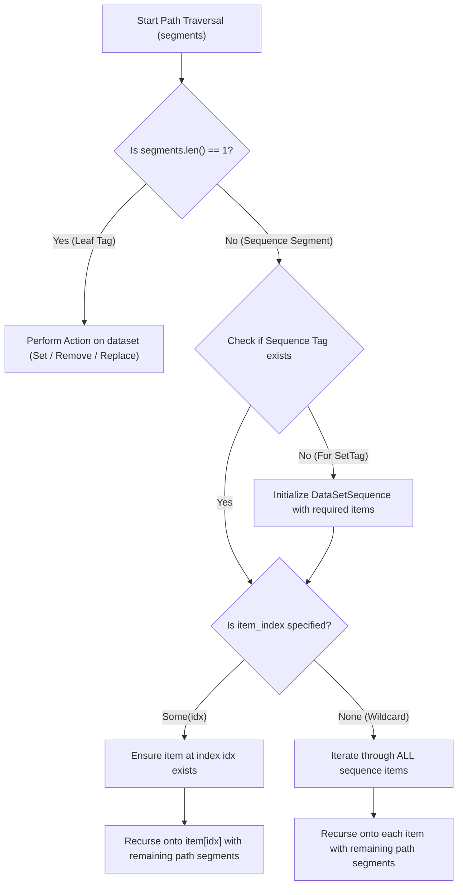

# System Design Specification (SDS) / Software Architecture Description

**Document ID:** SDS-DRT-001  
**Project:** `dicom-rs-transformer`  
**Regulatory Standard Alignment:** IEC 62304 Clause 5.3 / 5.4, FDA 21 CFR 820.30  

---

## 1. Executive Summary & Architectural Scope

`dicom-rs-transformer` is a high-performance, scriptable DICOM attribute transformation engine and Model Context Protocol (MCP) tool written in 100% safe Rust. It enables repeatable dataset manipulations, anonymization, and inspection prior to ingestion into clinical archives, AI model training pipelines, or research storage.

This document defines the subsystem decomposition, execution sequences, sequence path traversal contracts, macro evaluation mechanisms, and memory lifecycle boundaries.

---

## 2. System Subsystem Architecture

---

## 3. Subsystem Breakdown & Design Contracts

### 3.1 CLI & MCP Interface Subsystem (`src/main.rs`)
* **`main()`**: Dispatches commands parsed by `clap`.
* **Subcommands**:
  * `run`: Reads DICOM from `--input`, executes `--script` or `--dsl`, saves transformed result to `--output`.
  * `console`: Launches an interactive REPL session accepting line-by-line commands over standard input/output.
  * `validate`: Parses script/DSL files without executing dataset mutations to verify syntax correctness.
  * `compile`: Transpiles line scripts (`.txt`) into structured JSON specs (`.json`) or vice-versa.
  * `schema`: Generates the MCP JSON tool schema detailing available tools (`load_dataset`, `set_tag`, `remove_tag`, `replace_value`, `anonymize_patient`, etc.).
  * `install-mcp`: Automatically registers the binary path into host AI developer tool configurations (`~/.gemini/antigravity-ide/mcp/dicom-transformer.json`, Cursor, Claude Desktop).

---

### 3.2 DSL Specification & Data Models (`src/dsl.rs` & `src/script.rs`)

The system uses a unified specification model shared between line-by-line scripts and canonical JSON specifications.

* **`TransformSpec`**: Top-level specification containing metadata (`version`, `name`, `description`) and an ordered list of `Action` items.
* **`Action`**: Enum representing operations:
  * `LoadDataset { location }`
  * `SaveDataset { location }`
  * `SaveMap { location }`
  * `ExtractPixels { destination, format }`
  * `SetTag { selector, value }`
  * `RemoveTag { selector }`
  * `ReplaceValue { selector, pattern, replacement }`
  * `AnonymizePatient { patient_name, patient_id }`
* **`TagSelector`**: Flexible tag addressing format supporting:
  * Keyword: `"PatientName"`
  * Hex Pair String: `"(0010,0010)"`
  * Group/Element Tuple: `{ "group": 16, "element": 16 }`
  * Sequence Path String: `"RequestAttributesSequence[0]/ScheduledProcedureStepID"`

---

### 3.3 Transformation Engine & Path Evaluator (`src/engine.rs`)

The core execution engine targets `dicom_object::InMemDicomObject` provided by `dicom-rs`.

#### Path Traversal Syntax
Nested DICOM Sequence elements (VR = `SQ`) are addressed via Unix-style slash (`/`) path notation:

$$\text{Path} = \text{Tag}_1[\text{index}_1] / \text{Tag}_2[\text{index}_2] / \dots / \text{TargetTag}$$

| Path Pattern | Target Selection | Traversal Behavior |
| :--- | :--- | :--- |
| `PatientName` | Top-level element `(0010,0010)` | Single element lookup |
| `RequestAttributesSequence[0]/ScheduledProcedureStepID` | Item `0` of sequence `(0040,0275)` | Direct sequence item indexing |
| `RequestAttributesSequence/ScheduledProcedureStepID` | All items of sequence `(0040,0275)` | **Wildcard scanning**: Operates across every item in sequence |
| `ContentSequence[0]/ConceptNameCodeSequence[0]/CodeValue` | Deeply nested sequence item | Recursive hierarchy traversal |

---

### 3.4 Dynamic Macro Evaluator (`src/macro_eval.rs`)

String values passed to `SET` or `REPLACE` commands are dynamically evaluated at runtime before mutating datasets:

* **`$uid`**: Generates a valid ISO OID DICOM UID derived from UUID v4.
* **`$rand_str(n)`**: Generates a random uppercase alphanumeric string of length `n`.
* **`$rand_num(low, high)`**: Generates a random integer within `[low, high]`.
* **`$rand_time()`**: Generates a random DICOM formatted time string (`HHMMSS`).
* **`$today(offset)`**: Generates today's date formatted as `YYYYMMDD` with optional day offsets (e.g., `$today(-7)`).

---

### 3.5 Anonymization Audit Map (`src/map.rs`)

Maintains an audit ledger of all dataset modifications for regulatory tracking:
* Records `tag`, `keyword`, `original_value`, and `new_value`.
* Exportable to structured JSON files (`SAVE_MAP "audit_map.json"`) to enable de-anonymization lookup or HIPAA audit verification.

---

## 4. Memory Management & Safety Contracts

1. **Zero-Disk Staging**: Unencrypted DICOM payload bytes are parsed into Rust process memory (`InMemDicomObject`), mutated, and written directly to the target output stream without temporary disk file creation (`/tmp`).
2. **Rust Memory Safety**: 100% safe Rust guarantees no buffer overflows, double frees, or data race conditions during tag manipulations.

