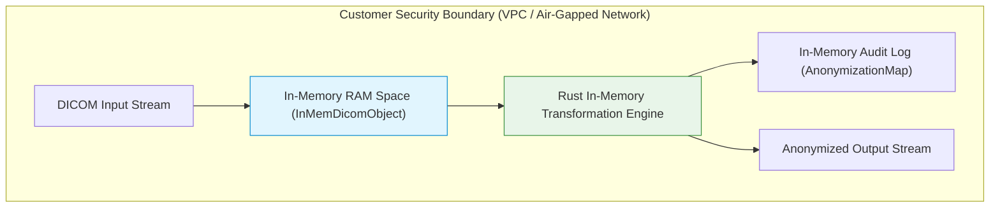

# Security Architecture & MCP Security Posture Guide

This document outlines the security posture, data protection principles, architectural safeguards, Model Context Protocol (MCP) access controls, and regulatory compliance alignment for `dicom-rs-transformer`.

It is intended for **security officers (CISOs)**, **compliance auditors**, **software developers**, and **enterprise architects** evaluating or developing with the software for clinical or research data pipelines.

---

## 1. Core Security Philosophy: Defense-in-Depth

`dicom-rs-transformer` is designed around a **Zero-Trust, Defense-in-Depth** security philosophy. It provides software building blocks designed to assist organizations in implementing HIPAA technical safeguards and data minimization practices.

### Key Security Commitments

1. **Zero-Disk Staging (In-Memory Execution)**: Datasets are loaded, parsed into Rust memory space (`InMemDicomObject`), mutated, and serialized strictly in-memory. Unencrypted PHI is **never written to temporary local disk files (`/tmp`) or swap buffers** during pipeline execution.
2. **Customer Data Sovereignty**: The software runs locally on customer workstations, within private cloud VPCs (AWS, GCP, Azure), or inside air-gapped hospital VLANs. **No data, telemetries, or DICOM payloads are ever transmitted back to third-party servers.**
3. **Memory Safety by Design (Rust)**: Built natively in 100% safe Rust, eliminating buffer overflow attacks, use-after-free vulnerabilities, memory corruption, and data races inherent in legacy C/C++ medical imaging utilities.

---

## 2. Division of Security Responsibility

Security in an open-source DICOM processing engine with MCP capabilities is a shared model between the software developer (the OSS maintainer) and the deployer (the developer/organization operating the tool).

| Security Layer | Responsibility | Owner | Key Practices |
| :--- | :--- | :--- | :--- |
| **In-Process Safety** | Tool logic, path sanitization, tag validation, error masking | OSS Software Developer | Strict parameter validation, path traversal prevention, avoiding PHI in logs |
| **MCP Host & OS Access** | Local file permissions, sub-process execution environment | Deployer / System Admin | Workstation OS user isolation, ACLs, strict file system permissions |
| **Network & Transport Auth** | Network perimeter, authentication, token management | Deployer / System Admin | OAuth2/OIDC gateways for network/SSE endpoints, TLS encryption |
| **Data Governance** | De-identification standards, PHI compliance | End User / Operator | Verification of anonymization rules (e.g. HIPAA Safe Harbor / PS 3.15 compliance) |

---

## 3. Model Context Protocol (MCP) Security Architecture

### Standard Stdio Local Execution
By default, `dicom-rs-transformer` installs as a local `stdio` MCP server tool spawning sub-processes within host applications like **Antigravity IDE**, **Cursor**, or **Claude Desktop**:

- **OS Session Boundary:** The MCP sub-process runs directly under the local user session. Process isolation and access control rely on operating system user privileges.
- **No Inherent Network Exposure:** Standard `stdio` transport does not open public TCP/UDP ports, minimizing external remote attacks.
- **Configuration Security:** Ensure JSON registration configs (e.g. `~/.gemini/antigravity-ide/mcp/dicom-transformer.json`) are only readable/writable by authorized system user accounts (`chmod 600`).

### Remote or SSE Deployments
If deploying `dicom-rs-transformer` as a shared or remote service via Server-Sent Events (SSE) or HTTP transports:

- **Do NOT expose raw MCP endpoints publicly.**
- Place an API Gateway or Reverse Proxy (such as NGINX, Envoy, or Cloudflare Access) in front of the server.
- Enforce authentication using **OAuth2 / OpenID Connect (OIDC)** or **mTLS (Mutual TLS)**.
- Secure transit using TLS (HTTPS).

---

## 4. Technical Safeguards & Data Handling

| Security Domain | Implementation | Security Benefit |
| :--- | :--- | :--- |
| **Data in Memory** | Evaluated strictly inside Rust stack/heap memory (`InMemDicomObject`). | Eliminates residual disk block traces if a server experiences power loss or hard crash. |
| **Data in Transit** | Integrates with `object_store` using mandatory TLS 1.3 / HTTPS encryption for cloud endpoints (`s3://`, `gs://`, `az://`). | Prevents eavesdropping or man-in-the-middle interception over network boundaries. |
| **Data at Rest** | Relies on customer's OS disk encryption (LUKS / BitLocker) for local files or cloud KMS (AES-256) for cloud storage. | Protects persisted outputs against physical media theft. |
| **Audit Controls** | Generates verifiable `AnonymizationMap` (`map.json`) logging original values, transformed values, and full tag path strings. | Satisfies HIPAA Audit Control requirements (45 CFR § 164.312(b)). |

---

## 5. Developer Best Practices for Code Contributions

When contributing to `dicom-rs-transformer`:

1. **Path Traversal Protection:** Always sanitize user- or AI-provided file paths to prevent unauthorized directory access (verifying paths stay within workspace bounds).
2. **Prevent Leakage of Protected Health Information (PHI):**
   - Ensure debug messages and error logs strip out patient metadata (e.g. Patient Name `(0010,0010)`, Patient ID `(0010,0020)`).
   - Keep diagnostic traces anonymized.
3. **Least Privilege Tool Capabilities:** When defining new MCP tools or console commands, separate read-only inspection operations from destructive state-modifying operations.

---

## 6. Deployment Environments & Compliance Alignment

`dicom-rs-transformer` supports deployment across all three standard healthcare environments:

### A. Access-Controlled Air-Gapped Clinical Networks
- Runs on dedicated, access-controlled hospital servers or PACS workstation nodes.
- Satisfies HIPAA Physical Access Controls (45 CFR § 164.310) and Technical Access Controls (45 CFR § 164.312(a)).

### B. Customer-Controlled Cloud VPC (AWS, GCP, Azure)
- Deployed inside customer private subnets (no public IPs) backed by a cloud provider Business Associate Agreement (BAA).
- Operates seamlessly with IAM role-based access control and KMS customer-managed keys.

### C. Local Developer & Research Workstations
- Operates on isolated local files (`file://`) for pre-flight testing and de-identification script authoring.

---

## 7. Regulatory & Compliance Disclaimer

> [!NOTICE]
> `dicom-rs-transformer` is an open-source software utility designed to process and modify DICOM datasets. 
> 
> - **Compliance Building Block**: Using this software alone does **not** automatically grant or guarantee HIPAA, GDPR, or regulatory compliance. Data governance, HIPAA compliance (45 CFR Part 164), and de-identification verification remain the sole responsibility of the operating organization.
> - **Medical Device Disclaimer**: Medical device manufacturers and clinical integrators incorporating this software into clinical workflows assume full responsibility for software validation, Quality Management Systems (ISO 13485), Clinical Risk Management (ISO 14971), and regulatory certification (e.g. FDA 510(k), CE-MDR).

---

## 8. Security Roadmap (PRO & Enterprise Extensions)

- [x] In-Memory DICOM Dataset Processing (`InMemDicomObject`)
- [x] Zero-Telemetry CLI & Script Execution
- [x] Full Tag Path Anonymization Audit Mapping (`map.json`)
- [x] MCP Access Security Guidelines & Stdio Boundary Controls
- [ ] Offline JWT Public Key Verification for PRO features
- [ ] Cryptographic Hash Chain Audit Logs for Tamper Evident Compliance
- [ ] In-Flight DICOM TLS PACS Gateway Interception (`dicom-rs-gw`)
